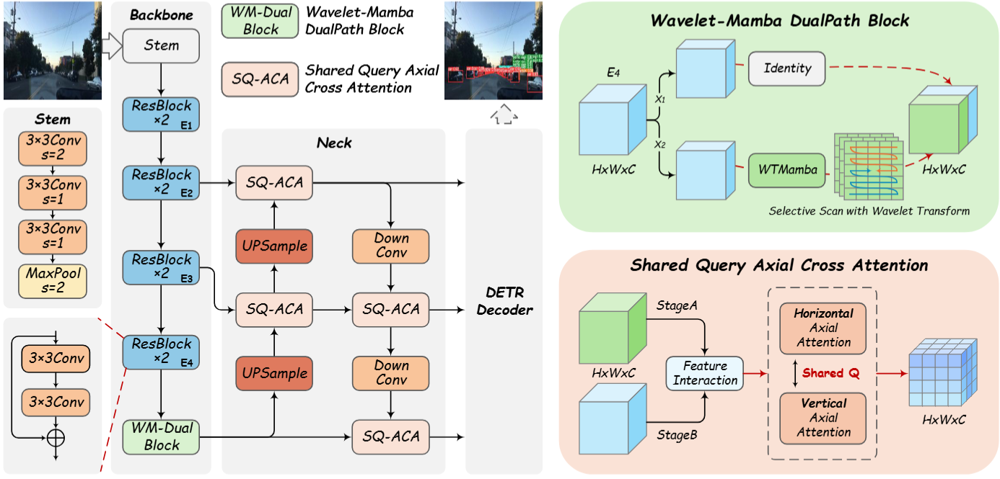
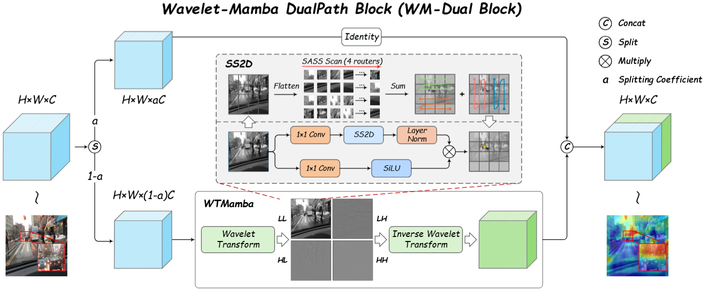
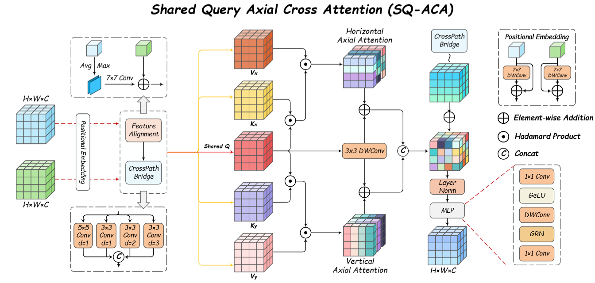
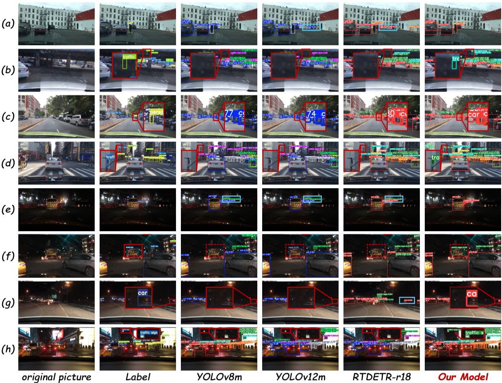

# WS-DETR: A Wavelet-Mamba and Shared Query Attention Enhanced DETR for Traffic Object Detection

**WS-DETR** is a real-time traffic object detection model built upon the **RT-DETR** framework. The model incorporates two key innovations:  

- **Wavelet-Mamba Dual Path Block (WM-Dual Block)** for improving small-object detection,  
- **Shared Query Axial Cross-Attention (SQ-ACA)** for enhancing robustness and reducing false detections in challenging environments like low-light conditions.

Both modules aim to solve critical challenges in traffic object detection, particularly small object detection and misdetections in complex traffic scenarios.

## Features

- **Real-time performance**: Designed for fast, efficient detection with high accuracy.
- **Small-object detection**: Enhanced ability to detect distant or small targets.
- **Robustness**: Effectively handles low-light conditions, occlusions, and dense traffic environments.
- **Transformer-based architecture**: Built upon the powerful DETR framework for end-to-end object detection.

## Model Architecture

The **WS-DETR** model incorporates two innovative modules to improve detection accuracy, especially in small-object detection and low-light scenarios. The architecture of the model is shown below:

The **WM-Dual Block** is shown below:

The **SQ-ACA** is shown below:

## Experimental Results

The experimental results of the **WS-DETR** model are presented in the table and figure below, demonstrating its superior performance in comparison to state-of-the-art models like YOLO and DETR variants.

The experimental results are visualized, showcasing the model's ability to detect small and distant objects, as well as reduce false positives in complex traffic scenes.

## Requirements

- Python 3.9.12
- PyTorch 2.4.2
- CUDA 12.2
- Additional Python packages: `torchvision`, `numpy`, `matplotlib`, `scipy`

## Train and Test

The training and testing scripts for WS-DETR will be released after the paper is officially published. Please stay tuned for the updates once the paper is available.

